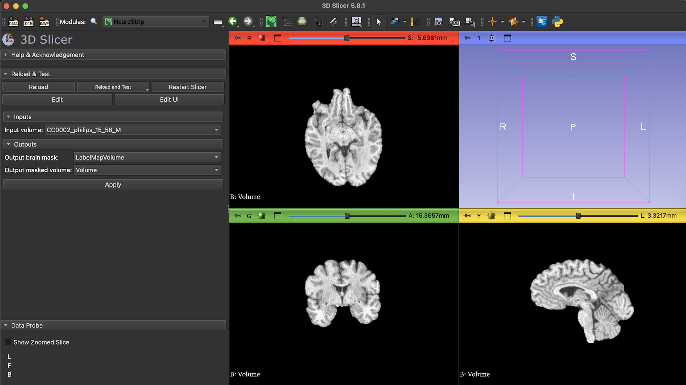

# NeuroStrip 3D Slicer Extension

This extension provides CNN-based skull stripping (brain masking) from MRI using the [NeuroStrip library](https://github.com/dyollb/neurostrip) directly within 3D Slicer.



## Features

- Automated brain mask generation from MRI volumes
- Optional masked brain volume creation
- Integration with 3D Slicer's volume handling
- User-friendly interface

## Installation

### From the Extension Manager

1. Open Extension Manager
2. Search for NeuroStrip
3. Install and restart 3D Slicer

### From Source

1. Open 3D Slicer
2. Go to `Edit` → `Application Settings` → `Modules`
3. In the "Additional module paths" section, click the folder icon
4. Navigate to and select the `slicer_plugin` directory containing the `NeuroStrip.py` file
5. Click `OK` and restart 3D Slicer
6. The NeuroStrip module should now appear in the `Segmentation` category

### Dependencies

The plugin will automatically install the NeuroStrip library ([see pyproject.toml](https://github.com/dyollb/neurostrip/blob/main/pyproject.toml)) when first loaded. However, you can also install it manually:

For CPU support:
```bash
pip install neurostrip[cpu]
```

For GPU support (requires CUDA):
```bash
pip install neurostrip[gpu]
```

## Usage

1. **Load your MRI volume** into 3D Slicer using `File` → `Add Data`

2. **Navigate to the NeuroStrip module**:
   - Go to `Modules` → `Segmentation` → `NeuroStrip`

3. **Configure inputs**:
   - **Input volume**: Select your MRI volume from the dropdown

4. **Configure outputs**:
   - **Output brain mask**: Select or create a new labelmap volume for the brain mask
   - **Output masked volume**: Select or create a new volume for the masked brain (only if the checkbox is enabled)

5. **Run the algorithm**:
   - Click the `Apply` button
   - The processing will take some time depending on the volume size and device
   - Results will be displayed in the 3D viewer

## Contributing

To modify the plugin:

1. Edit `NeuroStrip.py` for logic changes
2. Edit `Resources/UI/NeuroStrip.ui` for interface changes (use Qt Designer)
3. Add custom icons to `Resources/Icons/`
4. Test thoroughly before distribution

## License

This plugin follows the same MIT license as the NeuroStrip library.
